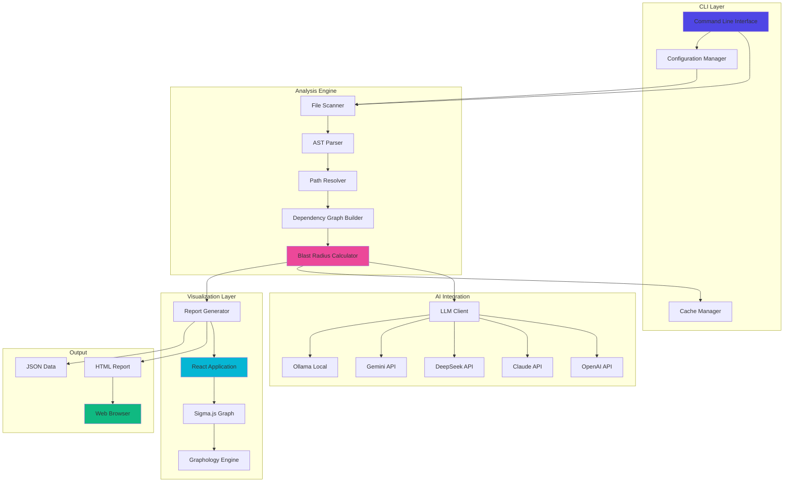
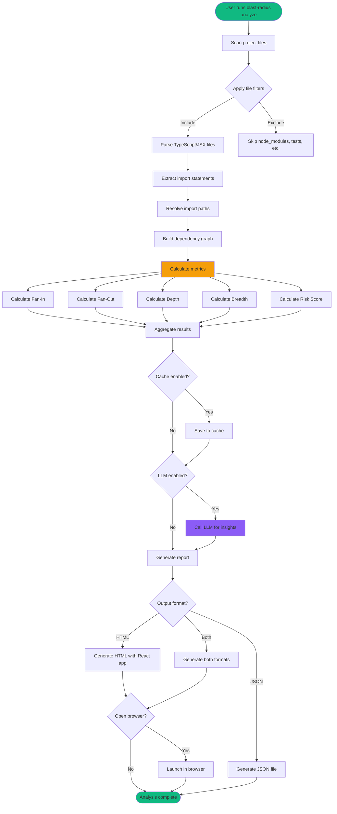
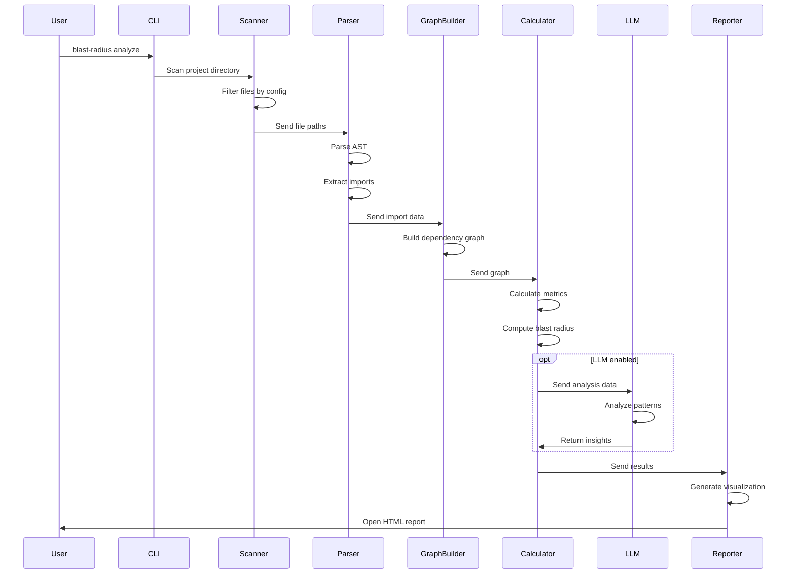

# 🔥 Blast Radius

**English** | [简体中文](README.zh-CN.md)

A powerful CLI tool for analyzing React component dependency relationships and assessing the "blast radius" of each component, helping you understand your project's engineering complexity and scalability.

## ✨ Features

- **Component Dependency Analysis**: Automatically scan and parse React component import/export relationships
- **Blast Radius Calculation**: Calculate metrics like fan-in, fan-out, depth, breadth, and risk scores
- **LLM-Powered Insights**: Optional AI analysis using OpenAI, Claude, DeepSeek, Gemini, or Ollama
- **Interactive Visualization**: Generate beautiful HTML reports with Sigma.js-powered graph visualization
- **Multiple Output Formats**: Export results as HTML, JSON, or both
- **Smart Caching**: Incremental analysis with file-based caching for faster re-runs
- **Configurable**: Flexible configuration via file or environment variables

## 🏗️ Architecture

### System Architecture



### Analysis Workflow



### Component Interaction Flow



## 📦 Installation

```bash
# Install globally
npm install -g blast-radius

# Or use with npx
npx blast-radius analyze
```

## 🚀 Quick Start

```bash
# Analyze current directory
blast-radius analyze

# Analyze specific project
blast-radius analyze /path/to/react/project

# Analyze without LLM
blast-radius analyze --no-llm

# Generate only JSON report
blast-radius analyze -o json
```

## ⚙️ Configuration

Create a `blast-radius.config.json` in your project root:

```json
{
  "scan": {
    "include": ["src/**/*.{ts,tsx,jsx}"],
    "exclude": [
      "node_modules/**",
      "**/*.test.{ts,tsx}",
      "**/*.spec.{ts,tsx}",
      "**/__tests__/**"
    ]
  },
  "analysis": {
    "depth": "full",
    "enableCache": true,
    "cacheDir": ".blast-radius/cache"
  },
  "llm": {
    "provider": "openai",
    "model": "gpt-4",
    "apiKey": "${OPENAI_API_KEY}",
    "enableCache": true
  },
  "output": {
    "format": ["html", "json"],
    "openBrowser": true
  }
}
```

### Environment Variables

- `BLAST_RADIUS_LLM_PROVIDER`: Override LLM provider
- `BLAST_RADIUS_LLM_API_KEY`: Override API key
- `BLAST_RADIUS_LLM_MODEL`: Override model selection
- `BLAST_RADIUS_CACHE_DIR`: Override cache directory
- `BLAST_RADIUS_LOG_LEVEL`: Set log level (DEBUG/INFO/WARN/ERROR)

## 📊 Metrics Explained

### Blast Radius Metrics

- **Fan-In (入度)**: Number of components that depend on this component
- **Fan-Out (出度)**: Number of components this component depends on
- **Depth**: Maximum downstream dependency chain length
- **Breadth**: Total number of files affected by modifying this component
- **Risk Score**: Weighted score (0-100) based on all metrics

### Risk Levels

- 🟢 **Low** (0-39): Safe to modify
- 🟡 **Medium** (40-59): Moderate impact
- 🟠 **High** (60-79): Significant impact, proceed with caution
- 🔴 **Critical** (80-100): Core component, changes will affect many files

## 🤖 LLM Integration

Blast Radius supports multiple LLM providers:

- **OpenAI**: GPT-4, GPT-3.5-turbo
- **Anthropic**: Claude 3 (Opus, Sonnet, Haiku)
- **DeepSeek**: DeepSeek Chat, DeepSeek Coder
- **Google**: Gemini Pro
- **Ollama**: Run local models (Llama 2, Mistral, etc.)

### Example: Using Ollama for Offline Analysis

```bash
# Install Ollama and pull a model
ollama pull llama2

# Configure blast-radius
export BLAST_RADIUS_LLM_PROVIDER=ollama
export BLAST_RADIUS_LLM_MODEL=llama2

# Run analysis
blast-radius analyze
```

## 🎨 Visualization

The generated HTML report features:

- **Interactive Graph**: Zoom, pan, and explore dependencies
- **Node Size**: Mapped to blast radius (larger = more impact)
- **Node Color**: Mapped to risk level (green → red)
- **Click to Explore**: Click nodes to view dependency chains
- **Search & Filter**: Find components by name or filter by risk level
- **Statistics Panel**: Overview of project health metrics

## 🔧 CLI Commands

```bash
# Analyze project
blast-radius analyze [path] [options]

# Manage configuration
blast-radius config --init          # Create config file
blast-radius config --show          # Show current config
blast-radius config --set key=value # Update config

# Clear cache
blast-radius clear-cache

# Show help
blast-radius --help
```

## 📈 Use Cases

1. **Code Review**: Understand the impact of proposed changes before merging
2. **Refactoring**: Identify safe-to-modify components vs. critical ones
3. **Architecture Review**: Visualize and analyze component dependency patterns
4. **Technical Debt**: Find highly coupled components that need decoupling
5. **Onboarding**: Help new developers understand codebase structure

## 🛠️ Development

```bash
# Clone repository
git clone https://github.com/qing/blast-radius.git
cd blast-radius

# Install dependencies
pnpm install

# Build CLI
pnpm build

# Build React app
pnpm build:app

# Run tests
pnpm test

# Development mode
pnpm dev
```

## 📝 License

MIT

## 🤝 Contributing

Contributions are welcome! Please read our contributing guidelines and submit pull requests to our repository.

## 📚 Documentation

For more detailed documentation, visit our [GitHub Wiki](https://github.com/qing/blast-radius/wiki).

## 🐛 Issues

Found a bug or have a feature request? Please open an issue on our [GitHub Issues](https://github.com/qing/blast-radius/issues).
