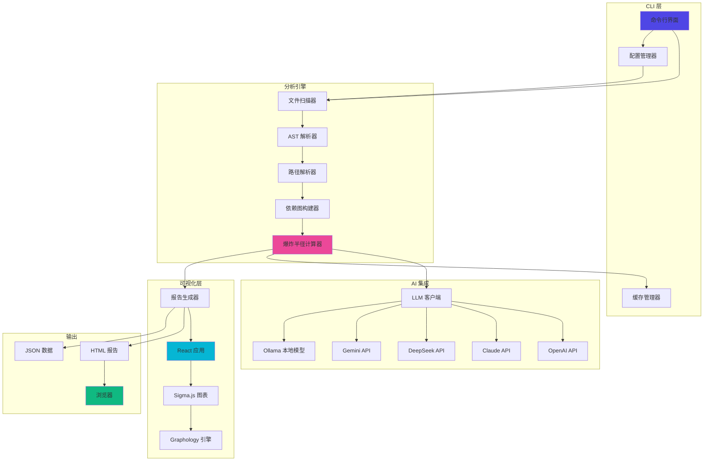
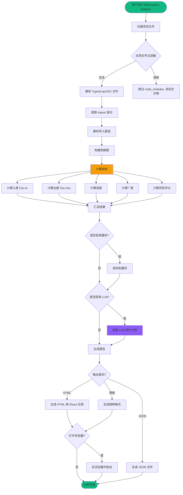
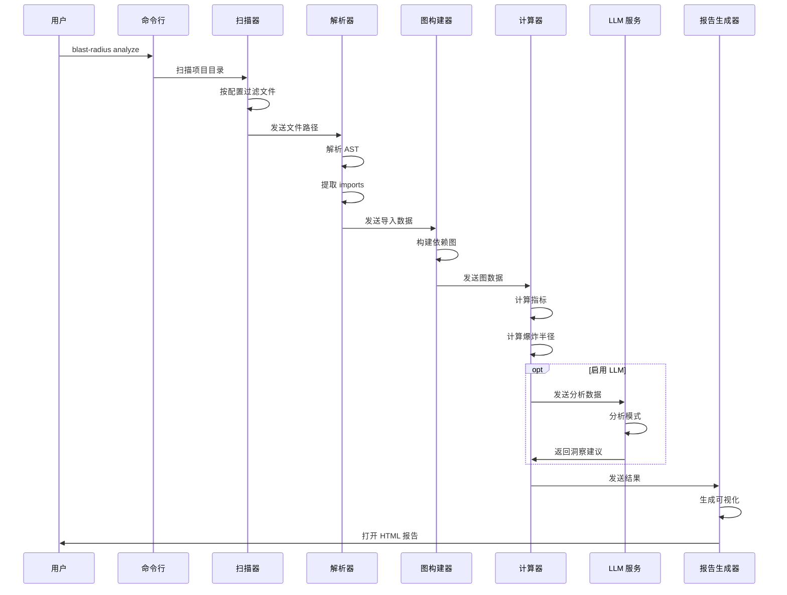

# 🔥 Blast Radius

[English](README.md) | **简体中文**

一个强大的 CLI 工具，用于分析 React 组件依赖关系并评估每个组件的"爆炸半径"，帮助您了解项目的工程复杂度和可扩展性。

## ✨ 功能特性

- **组件依赖分析**：自动扫描和解析 React 组件的 import/export 关系
- **爆炸半径计算**：计算入度、出度、深度、广度和风险评分等指标
- **LLM 智能分析**：可选的 AI 分析，支持 OpenAI、Claude、DeepSeek、Gemini 或 Ollama
- **交互式可视化**：生成精美的 HTML 报告，使用 Sigma.js 驱动的图可视化
- **多种输出格式**：导出结果为 HTML、JSON 或两者
- **智能缓存**：基于文件的增量分析缓存，加快重复运行速度
- **灵活配置**：通过配置文件或环境变量进行灵活配置

## 🏗️ 架构设计

### 系统架构



### 分析工作流程



### 组件交互流程



## 📦 安装

### 从 npm 安装（推荐）

```bash
# 全局安装
npm install -g blast-radius

# 或使用 npx
npx blast-radius analyze
```

### 本地开发测试

如果要在发布前进行本地测试：

```bash
# 克隆仓库
git clone https://github.com/qing/blast-radius.git
cd blast-radius

# 安装依赖
pnpm install

# 构建项目
pnpm build

# 方式 1: 使用 npm link（推荐）
npm link
blast-radius analyze  # 现在可以全局使用了

# 方式 2: 直接运行
node dist/index.js analyze

# 方式 3: 安装到全局
npm install -g .

# 测试完成后取消链接
npm unlink -g blast-radius
```

**注意：** 本项目使用 TypeScript 路径别名（`@/*` 代表 `./src/*`）来简化导入。构建过程（tsup）会在编译时自动解析这些别名。

## 🚀 快速开始

```bash
# 分析当前目录
blast-radius analyze

# 分析指定项目
blast-radius analyze /path/to/react/project

# 不使用 LLM 分析
blast-radius analyze --no-llm

# 仅生成 JSON 报告
blast-radius analyze -o json
```

## ⚙️ 配置

在项目根目录创建 `blast-radius.config.json`：

```json
{
  "scan": {
    "include": ["src/**/*.{ts,tsx,jsx}"],
    "exclude": [
      "node_modules/**",
      "**/*.test.{ts,tsx}",
      "**/*.spec.{ts,tsx}",
      "**/__tests__/**"
    ]
  },
  "analysis": {
    "depth": "full",
    "enableCache": true,
    "cacheDir": ".blast-radius/cache"
  },
  "llm": {
    "provider": "openai",
    "model": "gpt-4",
    "apiKey": "${OPENAI_API_KEY}",
    "enableCache": true
  },
  "output": {
    "format": ["html", "json"],
    "openBrowser": true
  }
}
```

### 环境变量

- `BLAST_RADIUS_LLM_PROVIDER`：覆盖 LLM 提供商
- `BLAST_RADIUS_LLM_API_KEY`：覆盖 API 密钥
- `BLAST_RADIUS_LLM_MODEL`：覆盖模型选择
- `BLAST_RADIUS_CACHE_DIR`：覆盖缓存目录
- `BLAST_RADIUS_LOG_LEVEL`：设置日志级别（DEBUG/INFO/WARN/ERROR）

## 📊 指标说明

### 爆炸半径指标

- **Fan-In (入度)**：依赖此组件的其他组件数量
- **Fan-Out (出度)**：此组件依赖的其他组件数量
- **Depth**：最大下游依赖链长度
- **Breadth**：修改此组件会影响的总文件数
- **Risk Score**：基于所有指标的加权评分（0-100）

### 风险等级

- 🟢 **低风险** (0-39)：可以安全修改
- 🟡 **中风险** (40-59)：影响适中
- 🟠 **高风险** (60-79)：影响较大，需谨慎操作
- 🔴 **极高风险** (80-100)：核心组件，修改会影响大量文件

## 🤖 LLM 集成

Blast Radius 支持多种 LLM 提供商：

- **OpenAI**：GPT-4, GPT-3.5-turbo
- **Anthropic**：Claude 3 (Opus, Sonnet, Haiku)
- **DeepSeek**：DeepSeek Chat, DeepSeek Coder
- **Google**：Gemini Pro
- **Ollama**：运行本地模型（Llama 2, Mistral 等）

### 示例：使用 Ollama 进行离线分析

```bash
# 安装 Ollama 并拉取模型
ollama pull llama2

# 配置 blast-radius
export BLAST_RADIUS_LLM_PROVIDER=ollama
export BLAST_RADIUS_LLM_MODEL=llama2

# 运行分析
blast-radius analyze
```

## 🎨 可视化

生成的 HTML 报告包含以下特性：

- **交互式图表**：缩放、平移和探索依赖关系
- **节点大小**：映射到爆炸半径（越大 = 影响越大）
- **节点颜色**：映射到风险等级（绿色 → 红色）
- **点击探索**：点击节点查看依赖链
- **搜索与过滤**：按名称查找组件或按风险等级过滤
- **统计面板**：项目健康指标概览

## 🔧 CLI 命令

```bash
# 分析项目
blast-radius analyze [path] [options]

# 管理配置
blast-radius config --init          # 创建配置文件
blast-radius config --show          # 显示当前配置
blast-radius config --set key=value # 更新配置

# 清除缓存
blast-radius clear-cache

# 显示帮助
blast-radius --help
```

## 📈 使用场景

1. **代码审查**：在合并前了解拟议更改的影响
2. **重构**：识别可安全修改的组件与关键组件
3. **架构审查**：可视化和分析组件依赖模式
4. **技术债务**：发现需要解耦的高度耦合组件
5. **入职培训**：帮助新开发人员了解代码库结构

## 🛠️ 开发

```bash
# 克隆仓库
git clone https://github.com/qing/blast-radius.git
cd blast-radius

# 安装依赖
pnpm install

# 构建 CLI
pnpm build

# 构建 React 应用
pnpm build:app

# 运行测试
pnpm test

# 开发模式
pnpm dev
```

## 📝 许可证

MIT

## 🤝 贡献

欢迎贡献！请阅读我们的[贡献指南](.github/CONTRIBUTING.md)并向我们的仓库提交 Pull Request。

## 📚 文档

更多详细文档，请访问我们的 [GitHub Wiki](https://github.com/qing/blast-radius/wiki)。

## 🐛 问题反馈

发现错误或有功能请求？请在我们的 [GitHub Issues](https://github.com/qing/blast-radius/issues) 上开一个问题。
